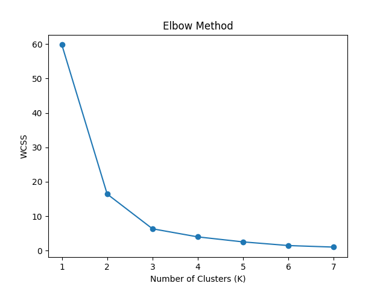
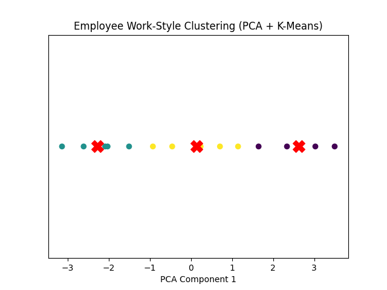

# Employee Work-Style Segmentation using Unsupervised Learning

## Problem Statement
Organizations often lack clear visibility into different employee work patterns.
This project applies unsupervised learning to identify distinct employee work-style
segments based on workload, productivity, and performance metrics.

---

## Dataset
The dataset contains the following features:
- Hours_Worked_Per_Week
- Tasks_Completed
- Overtime_Hours
- Performance_Score

Each row represents one employee.

---

## Methodology
1. Data cleaning and inspection
2. Feature scaling using StandardScaler
3. Dimensionality reduction using PCA
4. Optimal cluster selection using Elbow Method
5. Employee segmentation using K-Means clustering
6. Cluster interpretation and visualization

---

## Dimensionality Reduction
PCA revealed that **~99.6% of variance** lies in a single principal component,
indicating strong correlation between workload and performance-related features.
Hence, clustering was performed in 1D PCA space.

---

## Clustering Results
Using the Elbow Method, **K = 3** was selected as the optimal number of clusters.

### Identified Employee Segments:
- **Low Workload / Low Performance**
- **Balanced Performers**
- **High Workload / High Performance (Potentially Overworked)**

---

## 📈 Visualizations
<p><strong>Elbow Method Plot</strong></p>


<p><strong>PCA-based Cluster Visualization</strong></p>


---

## Tools & Technologies
- Python
- Pandas
- Scikit-learn
- Matplotlib

---

## How to Use This Project

Follow the steps below to run the project locally.

### 1. Clone the Repository


```bash
git clone https://github.com/VashishthSoni/Unsupervised-Employee-Segmentation.git
cd Unsupervised-Employee-Segmentation
```

### 2️. Create a Virtual Environment (Recommended)

```bash
python -m venv venv
```

Activate it:

**Windows**
```bash
venv\Scripts\activate
```

**macOS / Linux**
```bash
source venv/bin/activate
```

### 3️. Install Dependencies

```bash
pip install -r requirements.txt
```

### 4️. Run the Clustering Script

```bash
python src/employee_clustering.py
```

### 5️. View Outputs

After execution, the following files will be generated:

- outputs/elbow_plot.png – Elbow Method visualization
- outputs/cluster_plot.png – PCA-based cluster visualization
- outputs/clustered_employees.csv – Dataset with assigned cluster labels

---

## Key Takeaways
- PCA helps reveal true data structure by removing redundancy
- K-Means effectively groups employees based on work patterns
- Unsupervised learning can provide actionable business insights without labeled data
